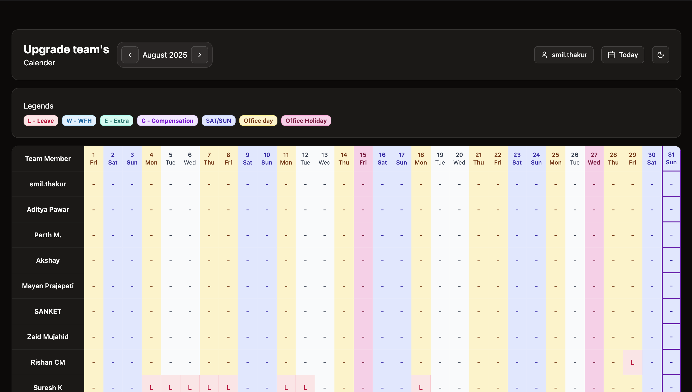

# DayFlow: Team Calendar & Schedule Manager

DayFlow is a modern, interactive calendar and schedule management app for teams. Built with React, TypeScript, Supabase, and Vite, it empowers organizations to visualize, manage, and optimize employee schedules with ease.

---

## 🚀 Features

- **Team Calendar View:**
  - See all team members and their daily statuses in a single, scrollable calendar grid.
  - Sticky headers and user columns for easy navigation.
- **Color-Coded Schedules:**
  - Distinct, accessible colors for Leave, WFH, Extra, Compensation, Office Days, Weekends, and Holidays.
- **Interactive Scheduling:**
  - Right-click or tap any cell to set your status (WFH, Leave, Extra, Compensation, or Clear).
  - Only the current user can edit their own schedule.
- **Keyboard Navigation:**
  - Use left/right arrow keys to quickly switch between months.
- **Authentication:**
  - Secure login via Supabase (magic link or OTP).
- **User Management:**
  - Add yourself to the team, change your display name, and see all team members.
- **Mobile-Friendly & Responsive:**
  - Works great on desktop and mobile devices.
- **GitHub Pages Ready:**
  - Seamless static deployment with correct routing and asset handling.

---

## 🌈 Visual Demo



---

## 🛠️ Getting Started

### 1. Clone & Install

```bash
git clone https://github.com/smil-thakur/DailyFlow.git
cd DailyFlow
npm install
```

### 2. Environment Setup

- Copy `.env.example` to `.env` and set your Supabase credentials:
  - `VITE_SUPABASE_URL=...`
  - `VITE_SUPABASE_ANON_KEY=...`

### 3. Run Locally

```bash
npm run dev
```

### 4. Deploy to GitHub Pages

- Build the app:

```bash
npm run build
```

- Deploy using your preferred method (e.g., `gh-pages` branch or GitHub Actions).

---

## 🧩 Tech Stack

- **Frontend:** React 18+, TypeScript, Vite
- **UI:** shadcn/ui, Tailwind CSS, Lucide Icons
- **Backend:** Supabase (Auth, Postgres)
- **Date Logic:** date-fns

---

## 💡 Usage & Impact

- **For Teams:**
  - Instantly see who is working from home, on leave, or available in the office.
  - Plan projects and meetings with full visibility of team availability.
- **For Managers:**
  - Reduce scheduling conflicts and improve resource planning.
  - Export or screenshot the calendar for reporting.
- **For Individuals:**
  - Quickly update your own status from any device.

---

## 📈 Why DayFlow?

- **Boosts Transparency:** Everyone knows the team's status at a glance.
- **Saves Time:** No more manual spreadsheets or endless status updates.
- **Accessible & Modern:** Clean, color-coded UI with keyboard and mobile support.
- **Open Source:** Easily customizable for your organization’s needs.

---

## 🤝 Contributing

Pull requests and suggestions are welcome! Please open an issue to discuss your ideas or report bugs.

---

## 📄 License

MIT

---

> Made with ❤️ by [smil-thakur](https://github.com/smil-thakur) and contributors.
